# AI-Native Investment Research System
## Design Document

Built on the Microsoft Agent Framework (Python).

---

## 1. Overview

### 1.1 Problem

Given one or more candidate stocks and an investor's objective - amount, risk
appetite, time horizon - produce a grounded recommendation with a suggested
portfolio allocation. The system must behave like a small team of specialist
analysts: research each candidate from different angles, debate the findings,
pressure-test the conclusion, and explain itself. It must be conversational,
remember the user across sessions, and be traceable end to end.

### 1.2 What the system does

Ten agents and one orchestration, reachable through a terminal CLI and a
Streamlit chat UI, with the Risk Analyst additionally served over A2A to other
runtimes. State persists in three places: the user's long-term memory, per-run
checkpoints, and the SEC vector store.

A run researches each candidate through a manager-led workflow, produces a draft
recommendation, subjects it to a bull-versus-skeptic debate, redrafts in light of
that debate, has a critic score the result, and writes the accepted answer to
long-term memory. Each recommendation must carry evidence items that name their
source, and every step emits an OpenTelemetry span.
### 1.3 Scope boundaries

- **Fundamentals are only grounded for companies whose filings have been ingested.**
  Other listed companies are analysed on price, news and macro; the system says
  so explicitly rather than silently producing a weaker answer.
- **This is a research tool, not an advisory product.** 
---

## 2. Requirements traceability 

The brief numbers its functional requirements 3.1 to 3.9. This document cites
them as **R3.1** to **R3.9**, keeping them distinct from its own section numbers,
which also run 3.1, 3.2 and so on. The table below is the key: any "R3.x"
elsewhere in this document resolves here.

| # | Requirement | Implemented in | Evidence |
|---|---|---|---|
| R3.1 | Multi-agent research team | 8 in `src/agents/`, plus the manager and the conversational assistant | Each has a bounded remit and explicit prohibitions |
| R3.2 | Central orchestration | `investment_orchestrator.py` - `MagenticBuilder` | Manager plans, delegates, decides sufficiency |
| R3.3 | Structured debate | `run_debate()` - 3 turns | Impact measured by diffing pre/post-debate drafts |
| R3.4 | Reflection & evaluation | `agents/evaluator.py`, `evaluate()` | Scores the brief's three criteria; bounded revision |
| R3.5 | Grounding via RAG | `src/rag/`, `tools/sec_tools.py` | `source` is a required field on every evidence item |
| R3.6 | Short- & long-term memory | `src/memory/` | `AgentSession` + `ContextProvider`; survives restart |
| R3.7 | Checkpointing & resumption | `memory/checkpoint.py` | Completed candidates skipped on resume |
| R3.8 | MCP & A2A | `src/mcp/`, `src/a2a_server.py` | Market data over MCP; Risk Analyst served over A2A |
| R3.9 | Observability | `src/observability.py` | Spans → live timeline, log file, OTLP dashboard |

---

## 3. High-Level Design

### 3.1 System context

| Actor / system | Role |
|---|---|
| User | States an objective, asks follow-up questions |
| Gemini API | The model behind every agent |
| SEC EDGAR | Source of 10-K filings (ingested offline) |
| yfinance | Market data, served through an MCP server |
| Marketaux | News and sentiment |
| OTLP collector | Optional trace dashboard (Jaeger, Aspire, Azure Monitor) |
| A2A clients | External runtimes calling the Risk Analyst |

### 3.2 Architecture

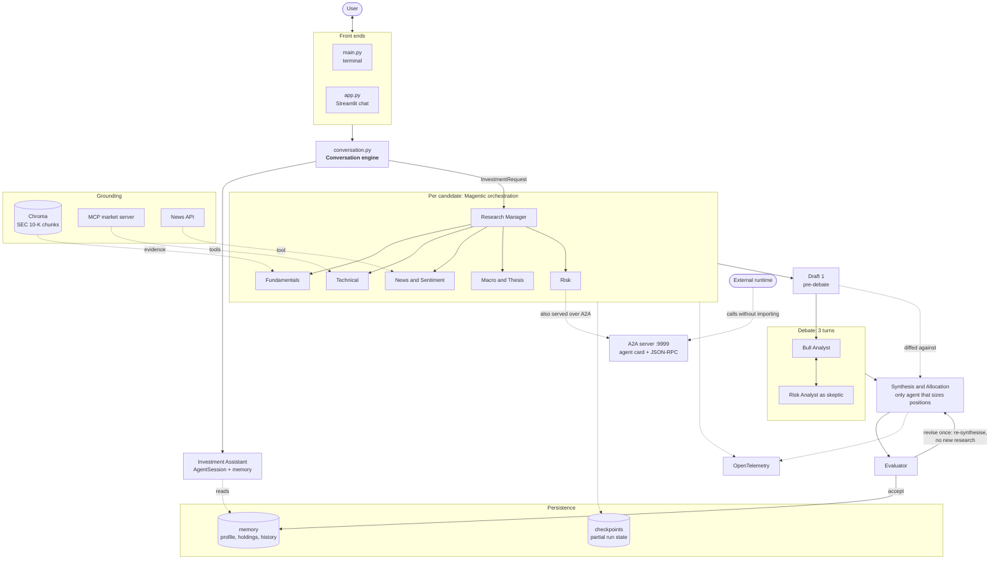

### 3.3 Component responsibilities

| Component | Owns | Does not |
|---|---|---|
| Conversation engine | Turn handling, intent, parameter extraction | Analyse stocks |
| Magentic manager | Who speaks, in what order, when to stop | Recommend or allocate |
| Five specialists | Findings in one lane each | Allocate, or stray into another lane |
| Bull / Skeptic | Arguing the same evidence | Allocate |
| Synthesis | Verdict, conviction, **allocation**, citations | Gather evidence |
| Evaluator | Scoring and rejection | Rewrite the draft |
| Memory | What persists across sessions | Anything within a run |
| Checkpoint | What survives a crash within a run | Anything across runs |

### 3.4 End-to-end flow

1. **Conversation** - one model call reads the user's message, decides chat vs
   analyse, and extracts parameters.
2. **Research** - per candidate, a Magentic workflow runs five specialists across
   four phases. Findings are checkpointed per candidate.
3. **Draft 1** - synthesis produces a recommendation *without* the debate.
4. **Debate** - bull opens, skeptic attacks, bull responds.
5. **Draft 2** - synthesis runs again with the debate and its earlier draft.
6. **Debate impact** - the drafts are diffed; differences are attributable to the
   debate alone.
7. **Evaluation** - the critic scores and may return it once for revision.
8. **Memory** - the accepted recommendation is persisted; the checkpoint is
   cleared.

### 3.5 Technology choices

| Concern | Choice | Why |
|---|---|---|
| Framework | Microsoft Agent Framework | Mandated |
| Orchestration | Magentic | Manager-led, named in the brief |
| Model | `gemini-3.5-flash-lite` | Cheap and fast enough for ~40 calls per run |
| Vector store | Chroma | Local, no service to run |
| Embeddings | `all-MiniLM-L6-v2` | Small, local, no API cost |
| Contracts | Pydantic | Validation, and the schema encodes the rubric |
| Tracing | OpenTelemetry | Named in the brief; vendor-neutral |
| UI | Streamlit | Minimal code over the same engine |

---

## 4. Low-Level Design

### 4.1 Agent roster

| Agent | Input | Tools | Output |
|---|---|---|---|
| Investment Assistant | The user's message, plus what is remembered about them | - | A conversational reply, the intent, and any extracted parameters |
| Research Manager | The research task and the user's objective | - | Who speaks next, and a closing consolidation of the analysts |
| Fundamentals | SEC filing evidence, injected into the task | - | Financial health, valuation, fundamental risks |
| Technical | Ticker | MCP: price, history, indicators | Trend, momentum, volatility |
| News & Sentiment | Ticker | `search_news` | Events, catalysts, sentiment |
| Macro & Thesis | The fundamentals, technical and news findings | - | Industry trends, secular drivers, long-term thesis |
| Risk | Every finding gathered so far | - | Vulnerabilities, downside scenarios |
| Bull | The same findings the skeptic receives | - | The strongest honest case in favour |
| Synthesis & Allocation | All findings, the debate transcript, the objective | - | `PortfolioRecommendation` |
| Evaluator | The synthesised `PortfolioRecommendation`, plus the objective | - | `Evaluation` |

Every specialist prompt forbids allocation, so exactly one agent sizes positions.

### 4.2 Data contracts

**`InvestmentRequest`** - the input boundary, and the shape memory persists.

| Field | Type | Notes |
|---|---|---|
| `user_id` | str | Keyed per user; multi-user is storage, not redesign |
| `tickers` | list[str] | Uppercased, de-duplicated, min 1 |
| `amount` | float | > 0 |
| `risk_appetite` | enum | conservative / moderate / aggressive |
| `horizon` | enum | short / medium / long |
| `constraints` | list[str] | Free text, e.g. "max 40% in one position" |

`objective_brief()` renders this as prompt text in one place, so every agent reads
the same definition of the user's constraints.

**`PortfolioRecommendation`** - the output boundary.

| Field | Constraint | Requirement it enforces |
|---|---|---|
| `stocks[].evidence[].source` | required | R3.5 traceability |
| `stocks[].debate_resolution` | required | R3.3 "not decorative" |
| `stocks[].assumptions` | min 1 | Explainability NFR |
| `stocks[].key_risks` | min 1 | Explainability NFR |
| `stocks[].conviction` | 1–5 | Confidence, distinct from verdict |
| `stocks[].allocation_percent` | 0–100 | The actual recommendation |
| `cash_percent` | auto-filled | Remainder treated as cash rather than failing |

**`Evaluation`** - three 1–5 scores (evidence quality, risks addressed, fit to
constraints), a verdict enum, and an actionable critique.

### 4.3 Run sequence

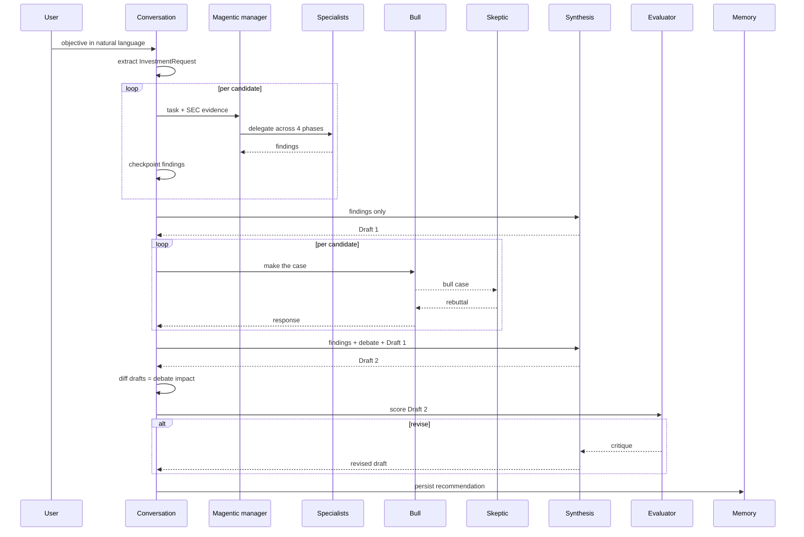

### 4.4 Orchestration

`MagenticBuilder` with five participants, `max_round_count=25`,
`max_stall_count=3`. A **fresh workflow per candidate**, so one stock's
conversation cannot leak into another's.

The manager is instructed to work through four phases. It decides who speaks and
when a phase is complete; the phases give it an order to work in rather than
leaving the sequence entirely to its judgement:

| Phase | What happens |
|---|---|
| 1 | Fundamentals, Technical and News & Sentiment establish the evidence base |
| 2 | Macro & Thesis evaluates the long-term case using those findings |
| 3 | Risk pressure-tests everything gathered so far |
| 4 | The manager notes agreements, disagreements and open questions, then stops |

The manager is explicitly forbidden from recommending or sizing positions in
phase 4. Its consolidation is passed to synthesis as one more input, not as a
conclusion.

The manager's closing summary is captured, but synthesis receives the
specialists' **raw text**: the manager compresses "$39,520M in marketable
securities (10-K 2026-02-25, Item 15)" into "strong liquidity", and you cannot
cite what was summarised away.

Findings are harvested from workflow events defensively - payloads arrive as a
lone response, a list, or an `AgentExecutorResponse` wrapper depending on the
event.

### 4.5 Debate

Three turns, run as explicit calls rather than inside Magentic. Both debaters
receive identical evidence, so neither wins by having more information. The third
turn is what makes it a debate: the bull must concede what lands or narrow the
claim.

Impact is measured, not asserted: synthesis runs once before the debate exists
and once after, and the drafts are diffed.

```
DEBATE IMPACT
NVDA: allocation 40.0% -> 30.0%
AMD:  allocation 20.0% -> 15.0%
cash  40.0% -> 55.0%
```

### 4.6 Reflection loop

`MAX_REVISIONS = 1`. The evaluator returns `revise` when any criterion scores ≤2,
a constraint is breached, a claim is unsourced, or the draft contradicts itself.
The critique is injected into a second synthesis call under a "REVISION REQUIRED"
heading.

**The loop returns to synthesis, not to the orchestrator.** The evaluator judges
the *draft*, not the evidence gathering: a breached constraint or an unaddressed
risk is a write-up problem, and re-running five analysts would not fix it while
costing several minutes. The corollary is a real limit - if a draft is weak
because the evidence is thin, the loop cannot ask for more research.

### 4.7 RAG pipeline

```
ingest.py      SEC EDGAR → data/sec/*.html + .json
processor.py   parse, section, chunk
vector_store.py  embed (MiniLM) → Chroma, metadata: ticker, filing, date, section
retriever.py   query with ticker filter, top-k
```

Retrieved chunks carry their filing and section, which is what allows synthesis
to write `source: "10-K 2026-02-25, Item 1A"` rather than an unattributed number.

### 4.8 Memory

Three scopes:

| Scope | Mechanism | Lifetime |
|---|---|---|
| Within a run | Explicit prompt composition | The run |
| Within a session | `AgentSession` | The conversation |
| Across sessions | JSON store + `ContextProvider` | Permanent |

Storage is a JSON file per user; delivery is the framework's `ContextProvider`,
attached **only** to the conversational agent. Writes are atomic (temp file +
rename). A missing or corrupt file yields empty memory rather than an error.

Each stored recommendation carries the full `InvestmentRequest` it ran under, so
a later, different investment cannot rewrite an earlier one's parameters. The
most recent objective is offered back as a default to confirm, never silently
reused.

### 4.9 Checkpointing

Two layers:

1. **Framework** - `FileCheckpointStorage` persists workflow state.
2. **Run-level** - completed candidates and their findings, saved after each
   candidate's research and each candidate's debate.

The run id is a **hash of the request**, so re-running the same command resumes
automatically with no id to track; changing the amount or the candidates produces
a different id, which is correct - that is a new analysis. The checkpoint is
deleted on success, or a resume mechanism becomes a stale cache.

### 4.10 MCP

`src/mcp/market_server.py` is a FastMCP stdio server exposing `get_stock_price`,
`get_historical_prices` and `get_technical_indicators`. Indicators are computed
server-side so the model never does arithmetic over 250 rows - cheaper and more
accurate. Incomplete trading sessions are dropped, since a NaN close corrupts the
latest price and every trailing return.

The stdio session is held open across the whole research phase, because the
manager may call the Technical Analyst in any round.

### 4.11 A2A

`src/a2a_server.py` serves the Risk Analyst over HTTP/JSON-RPC with an agent card
at `/.well-known/agent-card.json`. `A2AExecutor` adapts between the protocol's
task/message vocabulary and `agent.run()`.

The client test never imports the agent - it asserts the module was never loaded
in its process.

### 4.12 Observability

The framework's `configure_otel_providers()` installs a tracer provider with a
batch processor wrapping an OTLP exporter. A **second span processor** is
registered on the same provider for in-process handling: a live timeline, a full
trace log, and a per-agent latency and token tally.

Buffered export is right for a dashboard; unbuffered is required for live
progress. One provider, two processors, independent of each other.

### 4.13 Failure modes

Every layer fails safe, on the principle that support systems must not take the
analysis down with them.

| Failure | Behaviour |
|---|---|
| Synthesis output malformed | Validation error fed back, one repair attempt |
| Repair also fails | Raw text printed, `None` returned, run reports cleanly |
| Evaluator unparseable | Draft kept - a broken critic cannot discard good work |
| Revision unparseable | Original draft kept |
| Memory file corrupt | Empty memory, run continues |
| Checkpoint corrupt | Fresh run; worst case is repeated work |
| Orchestration stalls | 900s timeout, message naming the likely cause, resumable |
| Tracer provider absent | Warning, run continues untraced |
| Ticker not in the corpus | Analysed without fundamentals, flagged to the user |

---

## 5. Output

### 5.1 Conversational interface

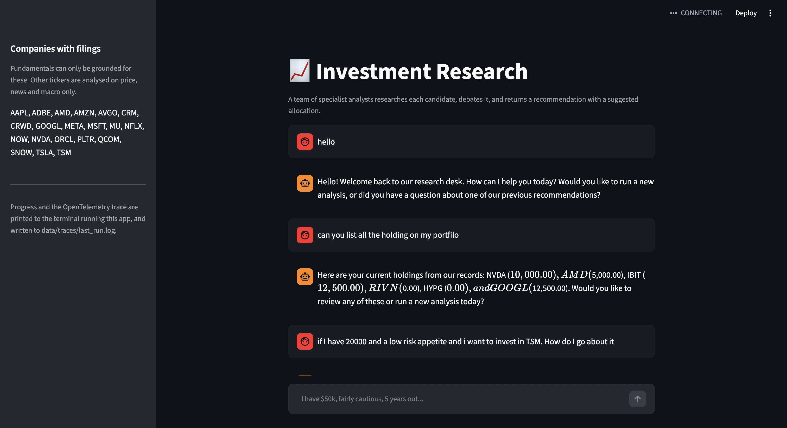

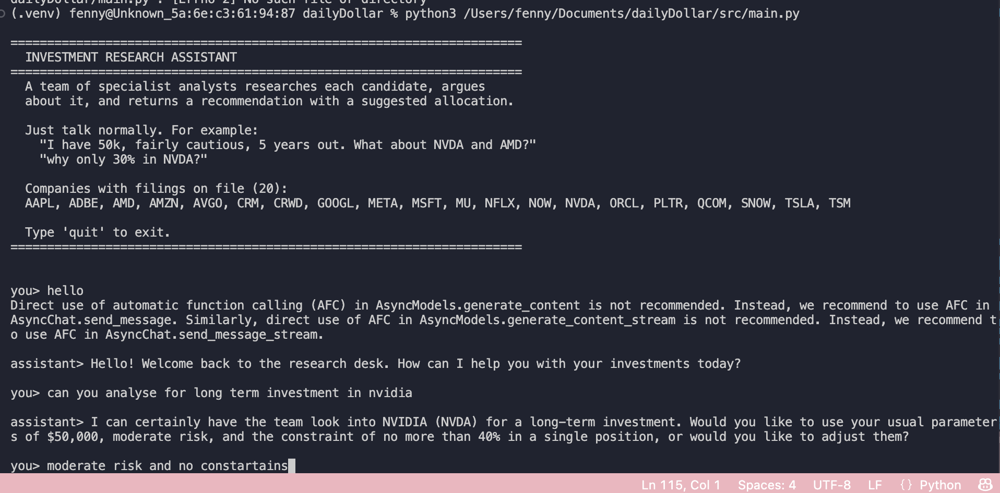

### 5.2 A recommendation

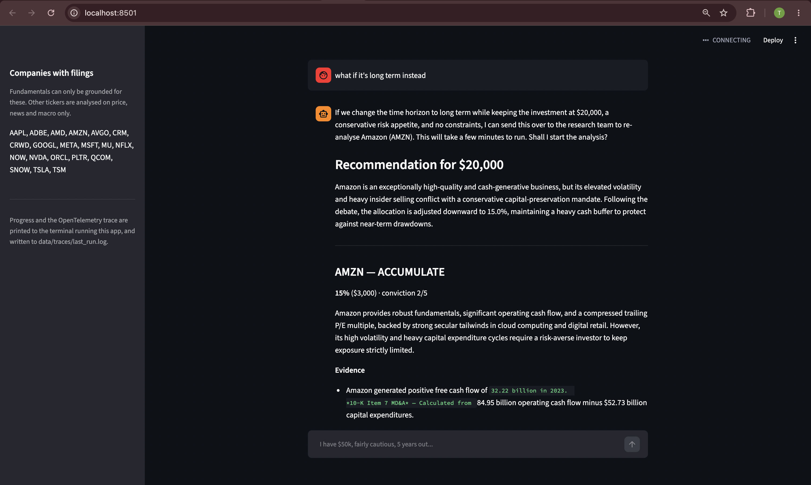
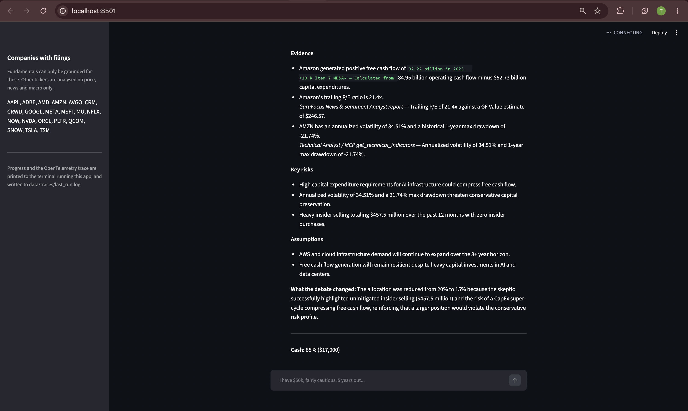

Each position carries a verdict, conviction, allocation, thesis, assumptions,
evidence with named sources, key risks, and what the debate changed.

### 5.3 Debate impact

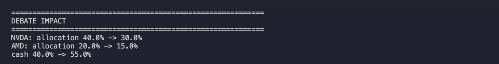

### 5.4 Checkpoint resume

Keyboard interrupt during seconf stock candidate analysis run
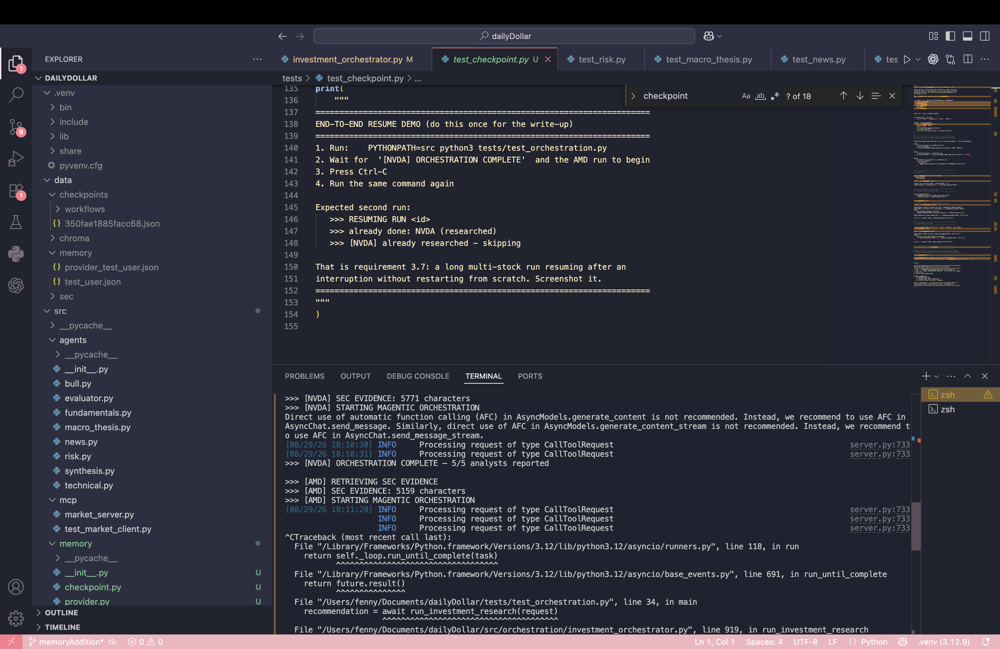

Resume from checkpoint
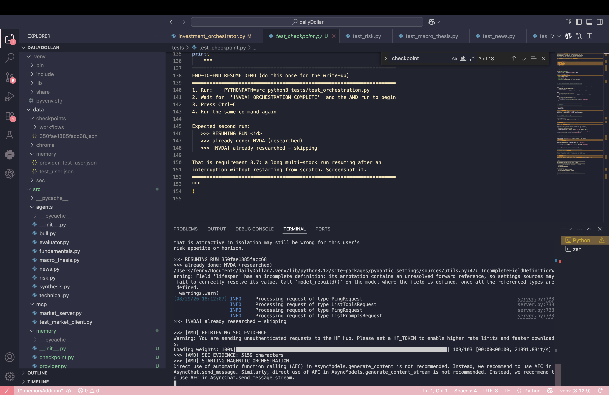


### 5.5 Observability

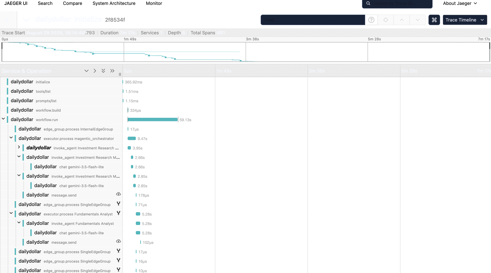

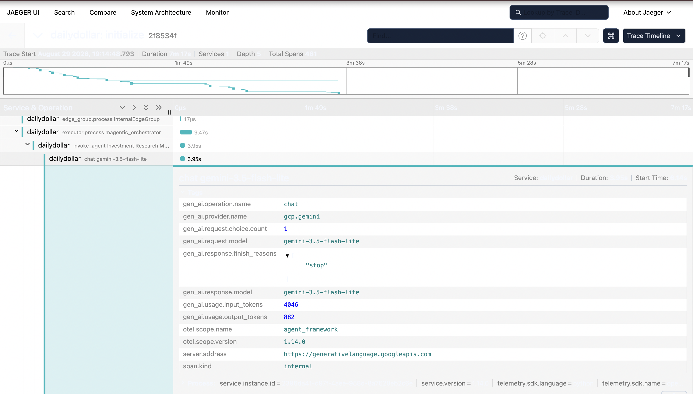

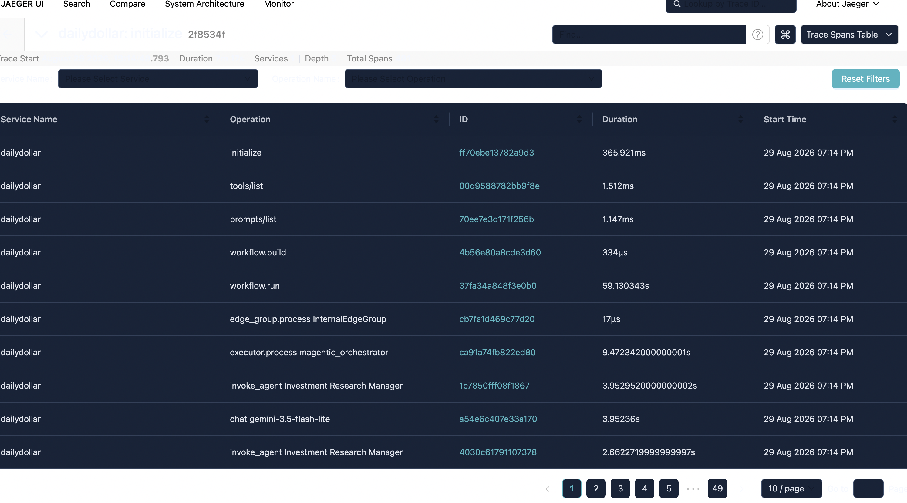

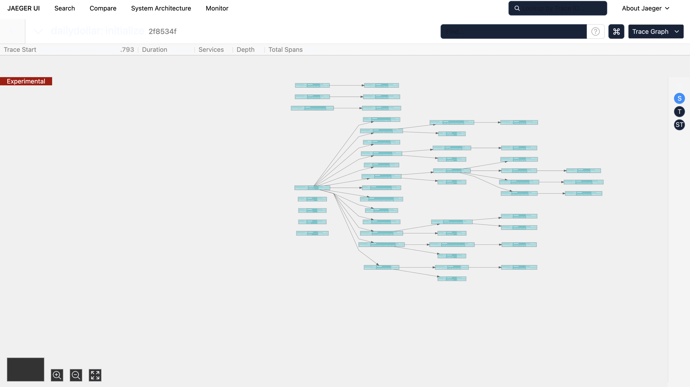

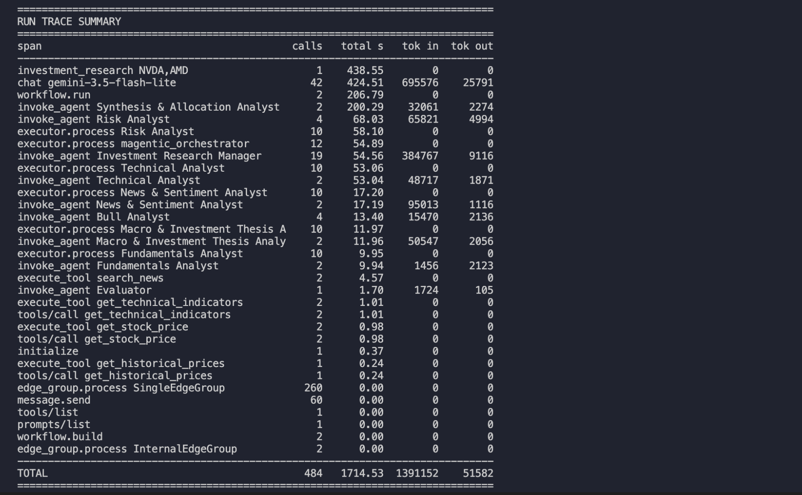

A full exported trace is in [`sample-trace.log`](docs/sample-trace.log).

---

## 6. Key decisions and trade-offs

- **Debate runs outside Magentic.** The manager decides for itself what is worth
  doing; R3.3 requires a debate every run. Trade-off: less native, but guaranteed
  and three predictable calls.
- **Synthesis runs twice.** Draft before the debate, draft after, then diff.
  Trade-off: one extra call, in exchange for the debate's effect being
  observable rather than self-reported.
- **Exactly one agent allocates.** Prevents allocation logic leaking into five
  prompts and gives constraints a single enforcement point.
- **Structured output only at the boundary.** Specialists stay prose; the schema
  makes R3.5 and R3.3 mechanically enforceable. Trade-off: a required field
  guarantees presence, not truth.
- **Specialists' raw text, not the manager's summary.** Citations survive.
  Trade-off: a larger synthesis prompt.
- **Fundamentals get pre-fetched evidence; Technical gets live tools.** Trade-off:
  deterministic and cheap, but Fundamentals cannot ask a follow-up of the filings.
- **Per-request parameters, not a fixed user profile.** The same person can be
  cautious with savings and speculative with a punt.
- **Memory injected via `ContextProvider`, scoped to one agent.** Manual injection
  fails silently when a new call site forgets it.
- **A2A exposed but not used internally.** Inside one process it adds a hop, a
  process and a failure mode for interoperability that isn't needed.
- **Checkpointing stops before the final synthesis.** Per-candidate research and
  the debate are checkpointed; the post-debate synthesis, the evaluation and any
  revision are not. Those are the last two or three calls of a run, each depends
  on everything before it, and the state to preserve is entangled. Trade-off: a
  crash at the very end repays a couple of calls, against carrying checkpoint
  logic through a stage where the saving would be marginal.
- **Custom span processor alongside the exporter.** Live progress is impossible
  with batched export alone - a lesson learned diagnosing a phantom hang.

---

## 7. Known limitations

- **The remote Risk Analyst has never run inside the orchestrator.** The orchestrator uses the in-process instance deliberately, so the pipeline does not depend on a second process being alive. Substituting A2AAgent(url=...) is a one-line change and A2A itself is verified end to end from a separate process.
- **The reflection loop can only re-synthesise, never re-research.** critique goes back into a fresh synthesis call over the same findings. That matches what the evaluator scores - a breached constraint or an unaddressed risk is a write-up problem, fixable from evidence already gathered. It also matches what a second research pass would actually yield: the analysts query the same filings, the same market data and the same news, so re-running them returns much the same evidence at several minutes' cost. Escalating to more research would mostly buy a slower version of the same answer.
- **The post-debate synthesis sees its own earlier draft**, When a recommendation is accepted, its allocations are recorded as the user's holdings. Nothing confirms execution, because the system is a research tool with no brokerage integration - there is no source of truth for what was actually bought. The consequence is bounded: holdings are context for later conversations, not an input to any calculation, so a stale entry degrades a follow-up answer rather than corrupting an analysis.
- **Holdings assume the user acted on the advice.** When a recommendation is accepted, its allocations are recorded as the user's holdings. Nothing confirms execution, because the system is a research tool with no brokerage integration - there is no source of truth for what was actually bought. The consequence is bounded: holdings are context for later conversations, not an input to any calculation, so a stale entry degrades a follow-up answer rather than corrupting an analysis.
- **Only the ingested companies can be grounded.** Fundamentals are retrieved from the vector store, so a company whose filings have not been ingested has no evidence base. This is a direct consequence of requirement R3.5 rather than an oversight: analysing such a company on remembered financials is exactly what "grounded in retrieved source documents" forbids. The system does not refuse - the technical, news and macro analysts work on any listed company - but it names the missing grounding in the output and the conviction score should be read accordingly.
- **Interrupting a run leaks the MCP subprocess** - The market-data server runs as a stdio subprocess inside an async context manager. On KeyboardInterrupt the interpreter tears down before the context manager's cleanup runs, leaving an orphaned process. It is idle and harmless - it holds no ports and shares no state - but it accumulates across interrupted runs and has to be cleared manually. A signal handler around the session would fix it.

## 8. Future scope

- **Cut the manager's context.** It consumed ~385k input tokens across 19 calls -
  roughly a quarter of a run - because the whole conversation is resent each
  round. The clearest cost lever, with measurements to justify it.
- **Return the retrieval tool to the Fundamentals Analyst**, so it can question
  the filings rather than work from one fixed query.
- **Wire framework checkpoint resume**, Resume an interrupted orchestration mid-flight. The framework already persists workflow state - conversation, task ledger, progress - at every step. What is missing is the read path: identifying the right checkpoint for an interrupted candidate and re-entering the workflow at that point. Resumption today works at the candidate level, so an interrupted run repeats at most one stock's orchestration rather than all of them, which was the expensive case and the one worth solving first. The writes are enabled so the capability is wired and the remaining work is the read side only.
- **Retry and backoff around model calls.** A stall currently waits out a 900s
  timeout; the timeout clarifies the failure but does not recover from it.
- **Automated, broader ingest**, making the grounded universe a configuration
  choice rather than whatever is on disk.
- **Retrieve from memory by relevance rather than recency**. The most recent recommendation is injected in full and the previous five as headlines, which covers follow-ups about the current portfolio. Questions reaching further back would be better served by searching the stored history the way the RAG layer searches filings - the data is all there, it simply isn't indexed.

---

## 9. Cost and performance

A sample two-candidate run, measured from the trace:

| Metric | Value |
|---|---|
| Wall clock | ~442s |
| Model calls | 42 |
| Input tokens | 1,391,152 |
| Output tokens | 51,582 |

| Agent | Calls | Input tokens |
|---|---|---|
| Research Manager | 19 | 384,767 |
| News & Sentiment | 2 | 95,013 |
| Risk (incl. debate) | 4 | 65,821 |
| Macro & Thesis | 2 | 50,547 |
| Technical | 2 | 48,717 |
| Synthesis | 2 | 32,061 |
| Fundamentals | 2 | 1,456 |

Guards against unbounded cost: `max_round_count=25`, `max_stall_count=3`,
`MAX_REVISIONS=1`, and checkpointing so interrupted work is never paid for twice.

Latency is dominated by provider variance, not the pipeline - individual calls
ranged from 0.98s to 196s for comparable work.

---

## 10. Testing strategy

| Test | Cost | Proves |
|---|---|---|
| `test_models.py` | free | Contracts accept valid data and reject malformed output |
| `test_memory.py` | free | Memory survives process death; per-run parameters preserved |
| `test_checkpoint.py` | free | A crash leaves resumable state; success clears it |
| `test_market_mcp.py` | free | MCP server exposes tools, returns clean data |
| `test_memory_provider.py` | 2 calls | Memory reaches the model, both scopes |
| `test_evaluator.py` | 2 calls | The critic discriminates good from bad |
| `test_synthesis.py` | 1 call | Synthesis fills the schema from findings |
| `test_technical_orchestrated.py` | ~3 calls | MCP tools work inside Magentic |
| `test_a2a.py` | 1 call | The Risk Analyst is callable across runtimes |
| `test_orchestration.py` | ~40 calls | The pipeline end to end |


