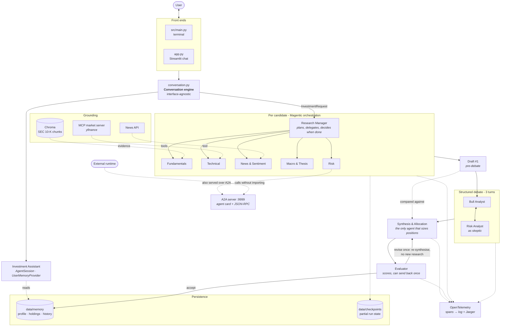

# AI-Native Investment Research System

A multi-agent investment research system built on the **Microsoft Agent Framework**.

Given one or more candidate stocks and an investment objective - amount, risk
appetite, time horizon - a team of specialist agents researches each candidate
from a different analytical angle, a bull and a skeptic debate the findings, a
critic scores the draft, and the system returns a grounded recommendation with a
suggested portfolio allocation.

It is conversational and remembers you between sessions:

```
you> I have 50k, fairly cautious, 5 years out. What about NVDA and AMD?
assistant> Starting the analysis now - this takes a few minutes...
           [full recommendation with allocations, evidence and risks]

you> why only 30% in NVDA?
assistant> The skeptic showed the Taiwan manufacturing concentration and
           hyperscaler capex cyclicality made a larger position hard to
           justify for a moderate risk profile...
```

That second answer comes from disk, not a re-run. Kill the process, start it
again tomorrow, and it still knows.

---

## Quickstart

**1. Install**

```bash
python3 -m venv .venv && source .venv/bin/activate
pip install -r requirements.txt
```

**2. Configure** - create `.env` in the repo root:

```
GEMINI_API_KEY=your_key_here
MARKETAUX_API_TOKEN=your_key_here
```

**3. Build the knowledge base** (once). Three stages: download the filings,
parse and chunk them, then embed them into the vector store the Fundamentals
Analyst reads from.

```bash
PYTHONPATH=src python3 src/rag/ingest.py
```

```bash
PYTHONPATH=src python3 src/rag/processor.py
```

```bash
PYTHONPATH=src python3 src/rag/vector_store.py
```

This takes a few minutes and downloads a 10-K per company from SEC EDGAR. The
set of companies is the `COMPANIES` list in `src/rag/ingest.py`; whatever ends up
in `data/sec/` becomes the universe the system can ground fundamentals for.

**4. Run**

```bash
PYTHONPATH=src python3 src/main.py
```

Or the chat UI:

```bash
streamlit run app.py
```

---

## Architecture



### The pipeline, in order

1. **Research** - for each candidate, a Magentic workflow runs five specialists
   through four phases. The manager decides who speaks and when there is enough
   evidence.
2. **Draft #1** - synthesis produces a recommendation *without* the debate.
3. **Debate** - the Bull opens, the Skeptic attacks, the Bull responds. Three
   turns, both sides given identical evidence.
4. **Draft #2** - synthesis runs again, now seeing the debate *and* its own
   earlier draft, and is told to change its numbers where the skeptic landed.
5. **Debate impact** - the two drafts are diffed. Any change is attributable to
   the debate alone.
6. **Evaluation** - a critic scores evidence quality, risks addressed, and fit
   to constraints, and can send a weak draft back once.
7. **Memory** - the accepted recommendation is written to disk.

---

## Requirements map

| # | Requirement | Where | Notes |
|---|---|---|---|
| 3.1 | Multi-agent research team | `src/agents/` | 7 agents: fundamentals, technical, news, macro, risk, bull, synthesis - plus an evaluator |
| 3.2 | Central orchestration | `investment_orchestrator.py` | Magentic (`MagenticBuilder`), manager-led |
| 3.3 | Structured debate | `run_debate()` | 3 turns; impact measured by diffing pre/post-debate drafts |
| 3.4 | Reflection & evaluation | `agents/evaluator.py`, `evaluate()` | Scores 1–5 on the brief's three criteria; one bounded revision |
| 3.5 | Grounding via RAG | `src/rag/`, `tools/sec_tools.py` | Chroma + MiniLM over 10-Ks; `source` is a required field on every evidence item |
| 3.6 | Short & long-term memory | `src/memory/` | `AgentSession` for the thread; `ContextProvider` for cross-session recall |
| 3.7 | Checkpointing & resumption | `memory/checkpoint.py` | Run-level: completed candidates skipped on resume. See limitations |
| 3.8 | MCP & A2A | `src/mcp/`, `src/a2a_server.py` | Market data over MCP; Risk Analyst exposed over A2A with card discovery |
| 3.9 | Observability | `src/observability.py` | OTel spans → live timeline, log file, and any OTLP dashboard |

---

## Observability

Every run writes a full trace to `data/traces/last_run.log` and prints a summary:

```
RUN TRACE SUMMARY
span                                     calls   total s   tok in  tok out
chat gemini-3.5-flash-lite                  42    424.51   695576    25791
invoke_agent Investment Research Manager    19     54.56   384767     9116
invoke_agent Fundamentals Analyst            2      9.94     1456     2123
execute_tool get_technical_indicators        2      1.01
```

Add `--trace` to stream spans live in the terminal.

### Sample trace

A full run's trace is committed in [`docs/`](docs/) - the exported timeline and
summary from one two-candidate run, plus screenshots of the same run in Jaeger.

### Optional: view traces in a dashboard

The system emits standard OTLP, so any compatible backend works. Jaeger needs no
account:

```bash
brew install colima docker && colima start
docker run -d --rm -p 16686:16686 -p 4317:4317 jaegertracing/all-in-one:latest
```

Then add to `.env`:

```
OTEL_EXPORTER_OTLP_TRACES_ENDPOINT=http://localhost:4317
OTEL_SERVICE_NAME=dailydollar
```

Open http://localhost:16686. **No code change** - Jaeger is never named in the
source. Aspire Dashboard or Azure Monitor work the same way.

> Use the `_TRACES_` variable specifically. The generic
> `OTEL_EXPORTER_OTLP_ENDPOINT` also routes metrics, which Jaeger does not
> implement, producing a stream of export errors.

---

## Agent-to-Agent (A2A)

The Risk Analyst runs as a standalone service any runtime can call.

```bash
# terminal 1
PYTHONPATH=src python3 src/a2a_server.py

# terminal 2
PYTHONPATH=src python3 tests/test_a2a.py
```

The client fetches the agent card from `/.well-known/agent-card.json`, then
sends it a thesis to pressure-test. It never imports the agent - the test
asserts the module was never loaded in that process.

---

## Tests

Run individually. The free ones cost nothing:

| Test | Cost | Proves |
|---|---|---|
| `test_models.py` | free | The input/output contracts, including rejecting malformed output |
| `test_memory.py` | free | Memory survives process death; per-analysis parameters are not overwritten |
| `test_checkpoint.py` | free | A crash mid-run leaves resumable state |
| `test_market_mcp.py` | free | MCP server exposes its tools and returns clean data |
| `test_memory_provider.py` | 2 calls | Memory actually reaches the model, both scopes |
| `test_evaluator.py` | 2 calls | The critic rejects a bad draft and accepts a good one |
| `test_synthesis.py` | 1 call | Synthesis fills the recommendation schema from findings |
| `test_technical_orchestrated.py` | ~3 calls | MCP tools work inside a Magentic run |
| `test_a2a.py` | 1 call | The Risk Analyst is callable across runtimes |
| `test_orchestration.py` | ~40 calls | The full pipeline end to end |

```bash
PYTHONPATH=src python3 tests/test_models.py
```

---

## Layout

```
src/
├── main.py                  terminal front end
├── conversation.py          conversation engine (interface-agnostic)
├── models.py                input/output/evaluation contracts
├── observability.py         OpenTelemetry wiring, trace summary
├── universe.py              which companies can be grounded
├── a2a_server.py            Risk Analyst as an A2A service
├── agents/                  the eight agents
├── orchestration/           Magentic workflow, debate, synthesis, evaluation
├── memory/                  long-term memory, context provider, checkpoints
├── mcp/                     market-data MCP server
├── rag/                     ingest, chunk, embed, retrieve
└── tools/                   SEC and news tools
app.py                       Streamlit chat UI
```

---

## Known limitations

Documented honestly in [DESIGN.md](DESIGN.md), including the framework-level
workflow checkpoints that are written but not read back, the untested
substitution of the remote Risk Analyst into the orchestrator, and where the
evaluator's calibration has not been verified.

## Cost profile

A two-candidate run is roughly **40 model calls, ~1.4M input tokens, ~7 minutes**.
The manager accounts for about a quarter of input tokens on its own, because the
whole conversation is resent every round. See DESIGN.md.
